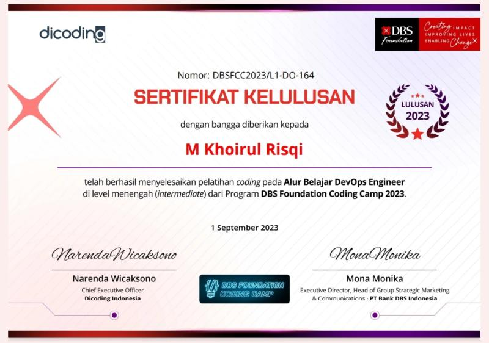
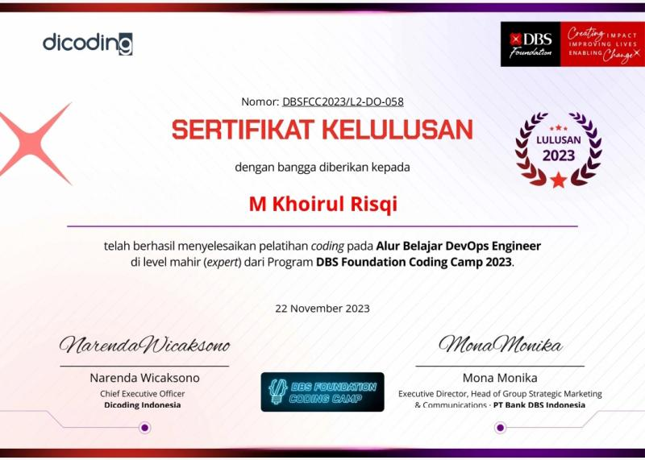
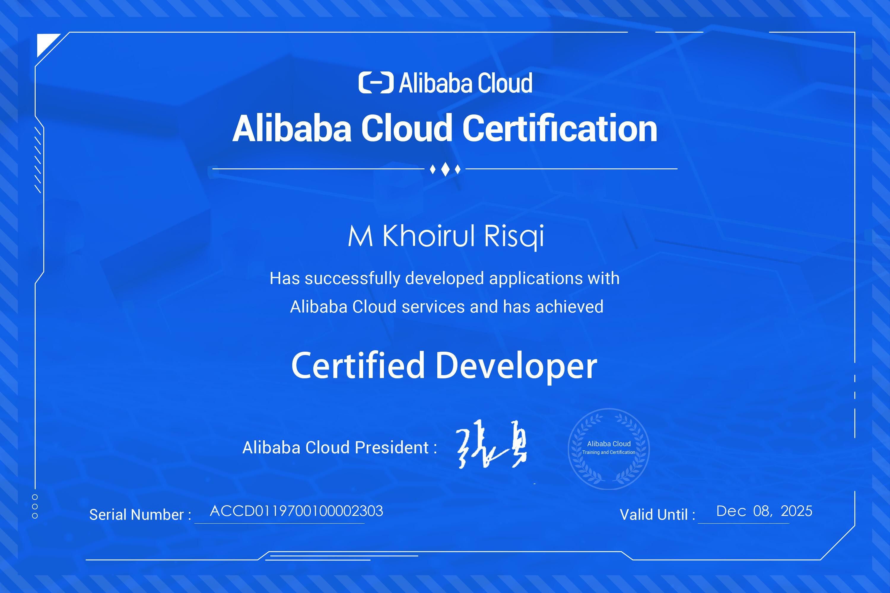
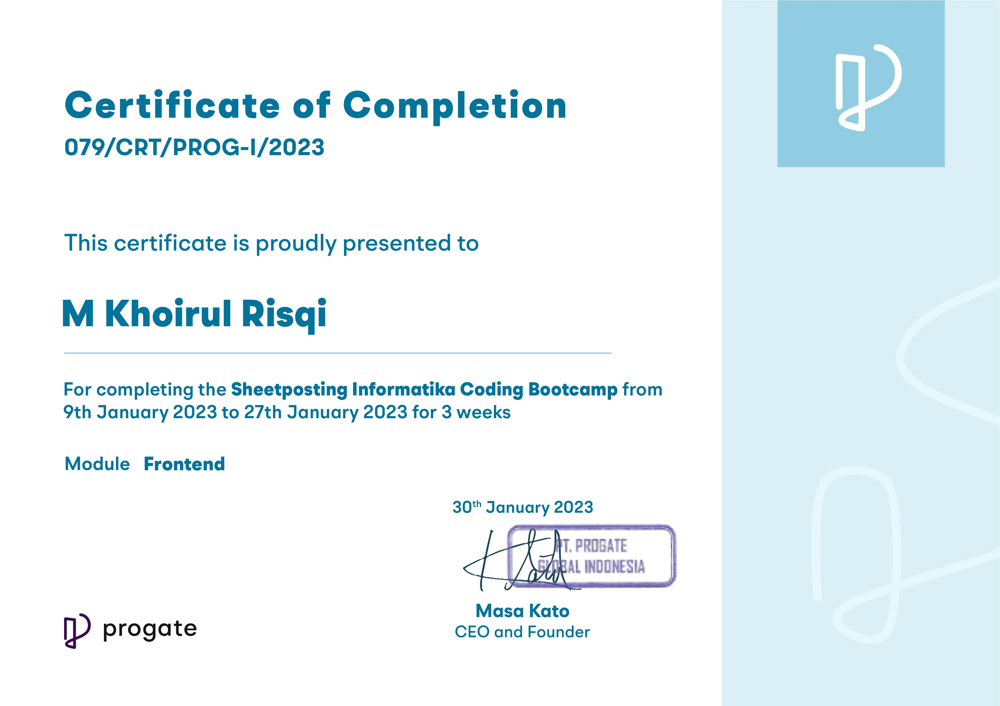

# Portfolio

## Personal Information

- **Name:** M Khoirul Risqi
- **University:** Universitas Nahdlatul Ulama Sunan Giri Bojonegoro (UNUGIRI Bojonegoro)
- **Professional Associations:** Asosiasi Ilmuwan Data Indonesia (AIDI)

## Summary

I am a computer science practitioner and a student at Universitas Nahdlatul Ulama Sunan Giri (UNUGIRI). Active in professional organizations such as the Asosiasi Ilmuwan Data Indonesia (AIDI), I have extensive experience in the blockchain industry with expertise in cryptocurrency, NFTs, Airdrops, marketing management, analysis, and trading. Additionally, I am proficient in various programming languages and am currently focused on developing projects that leverage blockchain technology. I also enjoy creating and experimenting with bots, backend systems, and have a keen interest in DevOps.

## Skills

- **DevOps Engineer**
  - Building Microsevices Architecture
  - Implementasi CI/CD

- **Blockchain Industry:**
  - Smart Contracts
  - Cryptocurrency
  - NFTs
  - Airdrops
  - Trading

- **BackEnd:**
  - Expressjs
  - Automation (Node.js) Engineer

- **Data:**
  - Data Mining

- **Programming Languages:**
  - JavaScript, PHP, Python, dan Solidity

## Projects

1. **[BOT-Discord-CoinGecko](https://github.com/risqikhoirul/BOT-Discord-CoinGecko)**  
   A Discord bot that integrates CoinGecko API to display cryptocurrency prices directly on Discord.

2. **[Blog-ExpressApi-MongooDB](https://github.com/risqikhoirul/Blog-ExpressApi-MongooDB)**  
   A simple blog application built with Express.js as the backend and MongoDB as the database for managing articles.

3. **[calculatorjs](https://github.com/risqikhoirul/calculatorjs)**  
   A JavaScript-based calculator application that performs basic mathematical operations.

4. **[discord-cloud-database](https://www.npmjs.com/package/discord-cloud-database)**  
   A Discord bot that connects to a cloud database to store user data and interactions within the server.

5. **[notes-wa-discord](https://github.com/risqikhoirul/notes-wa-discord)**  
   A Discord bot that allows users to save and access notes via WhatsApp.

6. **[Discord-Botpush](https://github.com/risqikhoirul/Discord-Botpush)**  
   A Discord bot for sending automated notifications or messages to a specific channel in Discord.

7. **[discordmedia](https://github.com/risqikhoirul/discordmedia)**  
   A Discord bot that facilitates sharing media (images, videos, files) within a server.

8. **[BscscanTokenTranfer-Scrapping](https://github.com/risqikhoirul/BscscanTokenTranfer-Scrapping)**  
   A script for scraping token transaction data from Binance Smart Chain via BscScan.

9. **[simple-restapi-crud](https://github.com/risqikhoirul/simple-restapi-crud)**  
   A simple REST API application that performs CRUD (Create, Read, Update, Delete) operations on data.

10. **[emot-discord](https://github.com/risqikhoirul/emot-discord)**  
    A Discord bot for managing and using custom emojis in server interactions.

11. **[Project Microservices](https://github.com/risqikhoirul/a433-microservices/branches)** & **[Project Microservices](https://github.com/risqikhoirul/microservice)**  
    Implementing microservices architecture for building applications with separate services communicating with each other.

12. **[HaloDek](https://github.com/risqikhoirul/HaloDek)**  
    An online platform for doctor and accommodation booking.

13. **[CertificateDapps](https://github.com/risqikhoirul/CertificateDapps)**  
    A blockchain-based application for issuing digital and decentralized certificates.

14. **[Tanahku](https://github.com/risqikhoirul/tanahku)**  
    A project based on NFTs for managing land certificates digitally and securely.

15. **[TABI - Travel & Bahasa Indonesia](https://github.com/tabiapp)**    
    TABI (Travel & Bahasa Indonesia) is an innovative application designed to bridge language gaps between international tourists and locals in Indonesia. It offers real-time English-Indonesian translation, along with curated insights into tourist destinations, local cuisines, and cultural etiquette. This app enhances the tourism experience and fosters cross-cultural understanding.

## Education

- **Degree:** S1 informatics engineering
  - **University:** Universitas Nahdlatul Ulama Sunan Giri Bojonegoro (UNUGIRI Bojonegoro)

## Professional Associations

- **Asosiasi Ilmuwan Data Indonesia (AIDI)**
  - **Role:** Member
  - **Duration:** Oktober 2023 - Present

## Certifications

- **DBS Foundation Coding Camp 2023 - DevOps Intermediate**
  
  

  Studied Linux, DevOps, Continuous Integration and Continuous Delivery (CI/CD). Attended weekly Zoom meetings.

- **DBS Foundation Coding Camp 2023 - DevOps Expert**

  

  Studied microservices, Docker, GitHub Packages, DevOps, RabbitMQ, Istio, Kubernetes. Attended weekly Zoom meetings.

- **Alibaba Cloud Certification**

  

  Learned how to deploy on Alibaba Cloud.

- **Sheetposting Informatika Coding Bootcamp Progate**

  

  Studied data science and basic frontend web development, attended Zoom meetings twice a week.

- For additional certifications, please visit my [LinkedIn Profile](https://www.linkedin.com/in/khoirulrisqi/details/certifications/).

- I frequently study materials on Dicoding. See more at my [Dicoding Profile](https://www.dicoding.com/users/khoirulrisqi/academies?graduation_status=graduated).

## Contact Information

- **Email:** risqisgb@gmail.com
- **LinkedIn:** [https://linkedin.com/in/khoirulrisqi](https://linkedin.com/in/khoirulrisqi)
- **GitHub:** [https://github.com/risqikhoirul](https://github.com/risqikhoirul)
- **Website:** [https://risqikhoirul.github.io](https://risqikhoirul.github.io)
