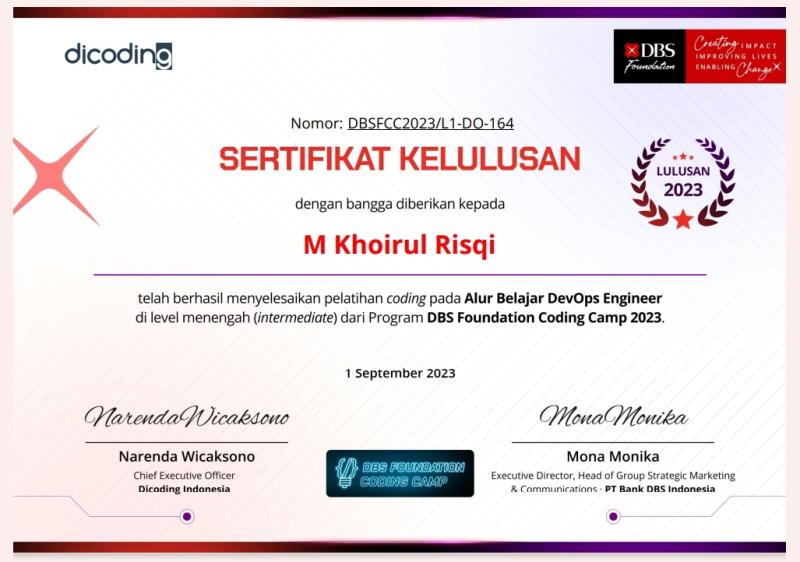
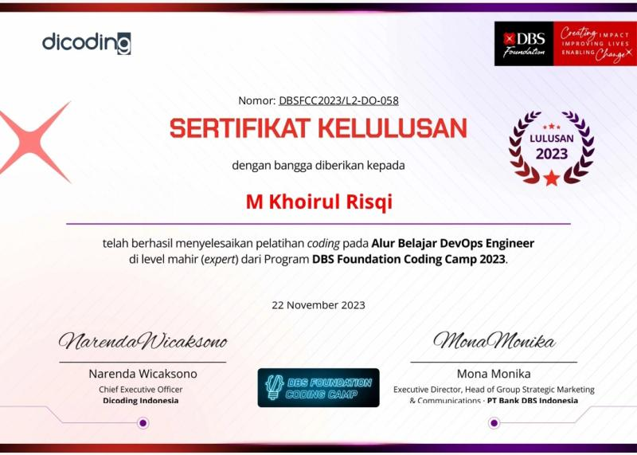
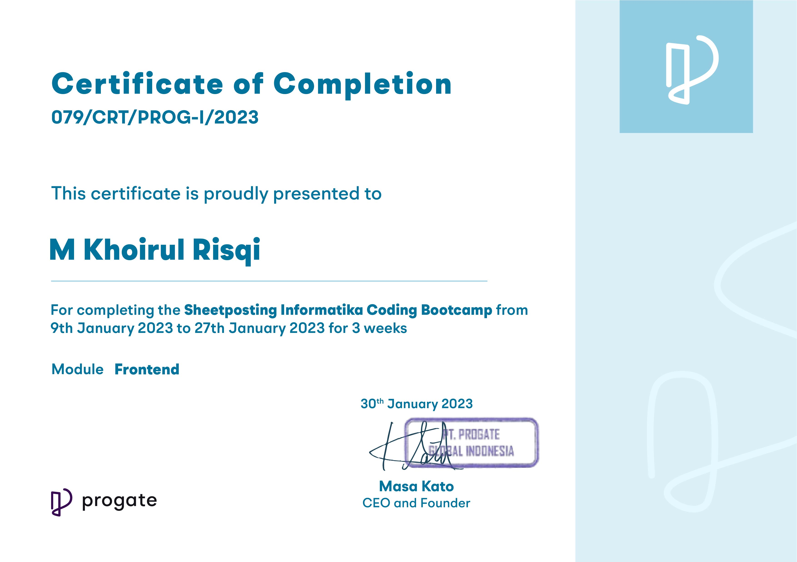

## Certifications

- **DBS Foundation Coding Camp 2023 - DevOps Intermediate**
  
  

  Studied Linux, DevOps, Continuous Integration and Continuous Delivery (CI/CD). Attended weekly Zoom meetings.

- **DBS Foundation Coding Camp 2023 - DevOps Expert**

  

  Studied microservices, Docker, GitHub Packages, DevOps, RabbitMQ, Istio, Kubernetes. Attended weekly Zoom meetings.

- **Alibaba Cloud Certification**

  

  Learned how to deploy on Alibaba Cloud.

- **Sheetposting Informatika Coding Bootcamp Progate**

  

  Studied data science and basic frontend web development, attended Zoom meetings twice a week.

- For additional certifications, please visit my [LinkedIn Profile](https://www.linkedin.com/in/khoirulrisqi/details/certifications/).

- I frequently study materials on Dicoding. See more at my [Dicoding Profile](https://www.dicoding.com/users/khoirulrisqi/academies?graduation_status=graduated).
